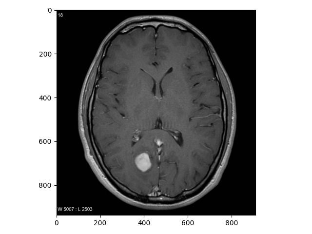
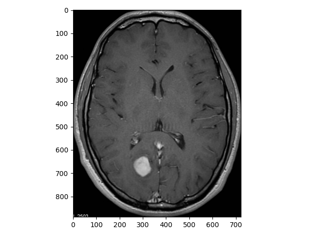
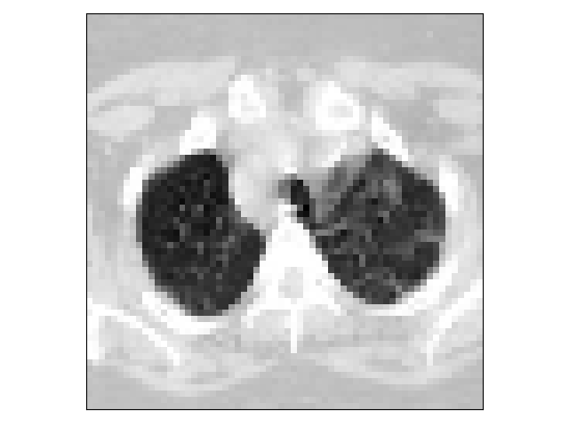
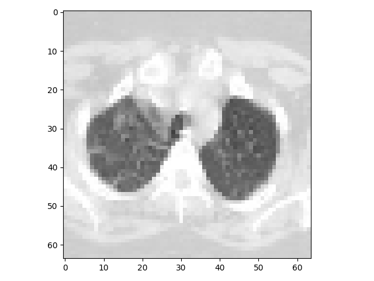
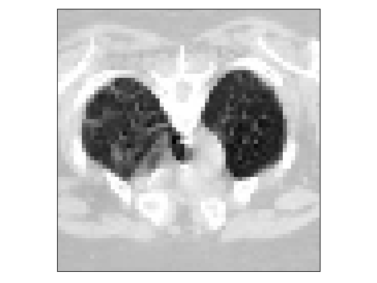
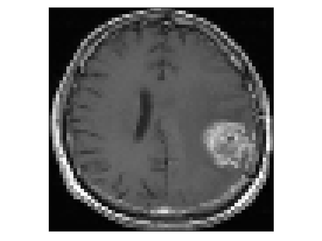
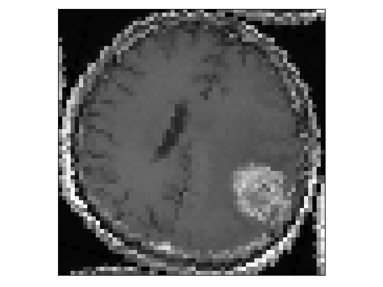
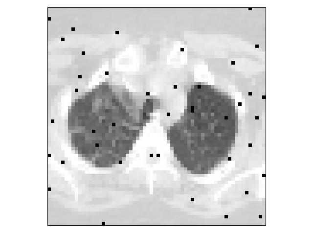
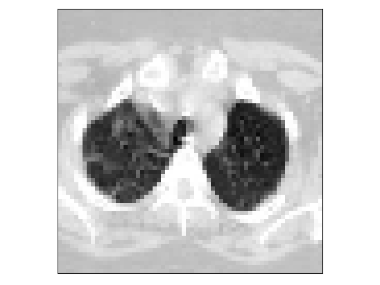

# Vlastné vrstvy pre augmentáciu datasetu
Táto práca vznikla a reprezentuje riešenie na zadanie Diplomovej práce.
Hlavným zámerom bolo vytvoriť funkčné riešenie augmentačných vrstiev, ktoré sa vo väčšine prípadov vykonávajú v časti 
predspracovania a prípravy dát. Praktická časť práce je písana v jazyku Python 3.8
## Použité knižnice
V tejto časti sú uvedené najdôležitejšie knižnice.
- Keras 2.4.3
- Tensorflow 2.4.1 
- Albumentations
- Numpy

**Upozornenie:** Je možné, že jednotlivé knižnice budú vyžadovať doinštalovanie ďalších dependency, 
ktoré nie sú uvedené v tomto zozname.
## Predspracovanie
Časť predspracovania je vykonaná len pri práci s MRI datasetom. Je to kvôli segmentácií samotného objektu mozgu, ktorá je vykonaná v skripte `MRISegmentation.py`.
Segmentácia je vykonaná tymto skriptom, ktorý prehľadáva obrázky v zložke `dataset`, kde sú uložené všetky MRI snímky. Výsledné snímky skript uloží do zložky `cropped`

    if not os.listdir().__contains__('cropped'):
        os.mkdir('cropped')
    for imagename in imgdir:
        if (imagename.upper().__contains__("JPG") or imagename.upper().__contains__(
                "JPEG") or imagename.upper().__contains__("PNG")):
            i += 1
            image = cv2.imread("dataset/" + imagename)
            gray = cv2.cvtColor(image, cv2.COLOR_BGR2GRAY)
            gray = cv2.GaussianBlur(gray, (5, 5), 0)
            thresh = cv2.threshold(gray, 45, 255, cv2.THRESH_BINARY)[1]
            thresh = cv2.erode(thresh, None, iterations=2)
            thresh = cv2.dilate(thresh, None, iterations=2)
            cnts = cv2.findContours(thresh.copy(), cv2.RETR_EXTERNAL,
                                    cv2.CHAIN_APPROX_SIMPLE)
            cnts = imutils.grab_contours(cnts)
            c = max(cnts, key=cv2.contourArea)
            extLeft = tuple(c[c[:, :, 0].argmin()][0])
            extRight = tuple(c[c[:, :, 0].argmax()][0])
            extTop = tuple(c[c[:, :, 1].argmin()][0])
            extBot = tuple(c[c[:, :, 1].argmax()][0])
            crop_img = image[extTop[1]:extBot[1], extLeft[0]:extRight[0]]
            cv2.imwrite("cropped/" + imagename, crop_img)
            
Tu sa vyhľadajú všetky kontúry v obrázku a násladne sa vyberú všetky krajné pixely. 
Súradnice týchto pixelov slúžia ako súradnice orezania obrázka.

Pôvodný obrázok           |  Orezaný obrázok
:-------------------------:|:-------------------------:
  |  

Následne tieto orezané snímky v zložke `cropped` rozdelí do svojích tried pomocu tohto kódu, kde premenná `IMG_SIZE` popisuje veľkos konečného obrázka

    IMG_SIZE = 64
    croppedImagesDir = os.listdir('cropped')
    i = 0
    
    for croppedImageName in croppedImagesDir:
        image = cv2.imread("cropped/" + croppedImageName, cv2.IMREAD_GRAYSCALE)
        image = cv2.resize(image, (IMG_SIZE, IMG_SIZE))
        image = image.reshape(64, 64)
        if croppedImageName.upper().__contains__("Y"):
            cv2.imwrite("resizedMRI64x64/yes/" + croppedImageName, image)
        else:
            cv2.imwrite("resizedMRI64x64/no/" + croppedImageName, image)
## Načítanie dát
Ďalšími krokmi sú samotné načítanie dát a ich rozdelenie na trénovaciu a testovaciu množinu. 
To je zabezpečené v tejto časti práce. Najprv si teda používateľ zadefinuje konštanty. 
Dôležité je hlavne určiť veľkosť snímkov.

    IMAGE_SIZE = 64
    SEED = 42
    BATCH_SIZE = 64

    def load_images_from_folder(folder):
        images = []
        for filename in os.listdir(folder):
            img = cv2.imread(os.path.join(folder,filename))
            if img is not None:
                images.append(img)
        return images
    folder="directory/folder path"

Je potrebné zadefinovať triedy, do ktorých budeme jednotlivé snímky klasifikovať a zároveň vybrať zdroj snímkov. 
V tomto prípade ide o model na klasifikáciu COVID-u a obrázky sú uložené v zložke datasetcovid. Pre zmenu zdrojových obrázkov je nutné upraviť premennú `source_dir`.

    disease_types=['COVID', 'non-COVID']
    source_dir = 'datasetcovid'
    data_dir = os.path.join(source_dir)
    
    all_data = []
    for defects_id, sp in enumerate(disease_types):
        for file in os.listdir(os.path.join(data_dir, sp)):
            all_data.append(['{}/{}'.format(sp, file), defects_id, sp])
    data = pd.DataFrame(all_data, columns=['File', 'DiseaseID','Disease Type'])
    data.head()
    
    data = data.sample(frac=1, random_state=SEED)
    data.index = np.arange(len(data)) # Reset indices
    data.head()
    
    def read_image(filepath):
        image = cv2.imread(os.path.join(data_dir, filepath))
        image = cv2.cvtColor(image, cv2.COLOR_BGR2GRAY)
        return image
    
    def resize_image(image, image_size):
        return cv2.resize(image.copy(), image_size, interpolation=cv2.INTER_AREA)
    
    data.info()
    
    formated_data = np.zeros((data.shape[0], IMAGE_SIZE, IMAGE_SIZE))
    
    for i, file in tqdm(enumerate(data['File'].values)):
        image = read_image(file)
        if image is not None:
           formated_data[i] = resize_image(image, (IMAGE_SIZE, IMAGE_SIZE))

Táto časť kódu zabezpečuje normalizáciu obrázka a následne samotné rozdelenie do trénovacej a testovacej množiny.

    formated_data = formated_data / 255.
    formated_data = formated_data.reshape((formated_data.shape[0], formated_data.shape[1],formated_data.shape[2], 1))
    print('Data Shape: {}'.format(formated_data.shape))
    formated_data_labels = data['DiseaseID'].values
    train_data, test_data, train_labels, test_labels = train_test_split(formated_data, formated_data_labels, test_size=0.3, random_state=SEED)
    

## Vytvorené riešenie
Výstup tejto práce sú štyri funkčné vrstvy, ktoré dokážu augmentovať 
obrázkovy vstup. Tie majú slúžiť používateľovi na augmentáciu a následne učenie modelu. 
Jednotlivé zdrojové kody pre každú vrstvu sa nachádzajú v zložke `CustomLayers`.

### FlipLayer
    from keras.layers import Layer
    import keras.backend as K

    class HorizontalFlipLayer(Layer):
        def __init__(self, num_outputs, name='HorizontalFlipLayer', **kwargs):
            super(HorizontalFlipLayer, self).__init__(**kwargs)
            self.num_outputs = num_outputs

        def build(self, input_shape):
            super(HorizontalFlipLayer, self).build(input_shape)

        def call(self, inputs, **kwargs):
            return K.reverse(inputs, axes=2)

        def compute_output_shape(self, input_shape):
            return (input_shape[0], self.output_dim)

        def get_config(self):
            base = super(HorizontalFlipLayer, self).get_config()
            base['num_outputs'] = self.num_outputs
            return dict(list(base.items()))

Táto vrstva slúži na horizontálne preklápanie obrázkov. Celá funkcionalita 
samotnej augmentácie je zapísaná vo funkcii `call`. V tej vrstva preklopenia 
využíva backend kerasu, ktorý vstupný object (Tensor) prevráti podľa zadanej osi. 
V tomto prípade ide o horizontálne prevrátenie takže podľa druhej osi (y). 
Ide o parameter z `input_shape`, ktorý ma tvar `[batch, width, height, channel]`.

Pôvodný obrázok           |  Preklopený obrázok
:-------------------------:|:-------------------------:
  |  

### VerticalFlipLayer
        def call(self, inputs, **kwargs):
            return K.reverse(inputs, axes=1)
Rovnaký postup je aj pri vertikálnom prevrátení len je zadaná x-ová os.

Pôvodný obrázok           |  Preklopený obrázok
:-------------------------:|:-------------------------:
  |  

### Rotation Layer

    class RotationLayer(Layer):
        def __init__(self, num_outputs,lower_bound = None, upper_bound = None, name = 'RotationLayer', **kwargs):
            super(RotationLayer, self).__init__(**kwargs)
            self.num_outputs = num_outputs
            self.lower_bound = lower_bound
            self.upper_bound = upper_bound
    
        def build(self, input_shape):
            super(RotationLayer, self).build(input_shape)
    
        def call(self, inputs, **kwargs):
            if self.lower_bound is not None and self.upper_bound is not None:
                angle = (random.randint(self.lower_bound,self.upper_bound))*math.pi/180
                rotated = tfa.image.rotate(inputs, angles=round(angle),fill_mode='wrap')
            elif self.lower_bound is not None:
                angle = (random.randint(self.lower_bound,360))*math.pi/180
                rotated = tfa.image.rotate(inputs, angles=round(angle),fill_mode='wrap')
            elif self.upper_bound is not None:
                angle = (random.randint(-360,self.upper_bound))*math.pi/180
                rotated = tfa.image.rotate(inputs, angles=round(angle),fill_mode='wrap')
            else:
                angle = (random.randint(-360,360))*math.pi/180
                rotated = tfa.image.rotate(inputs, angles=round(angle),fill_mode='wrap')
            rotated = tf.reshape(rotated, shape=[-1, 64, 64, 1])
            return rotated

V tejto vrstve je dôležitá aj samotná inicializácia a zadávanie parametrov. 
Tie slúžia ako hraničné hodnoty v prípade, že sú zadané. 
Ak zadané nie sú vygenerované číslo môže nadobúdať hodnoty od -360 po 360 aby bolo zabezpečené otáčanie v oboch smeroch.
Prípadne ak je zadaný len jeden parameter tak sa vygenerujú číslo od -360,x prípadne od x po 360.
Keďže vstup do funkcie rotate musí byť zadané v radiánoch a pre používateľa je 
príjemnejšie zadávať hodnoty v stupňoch prepočet je vykonávaný priamo vo vrstve. Pre
vyplnenie novovzniknutého miesta je použitá metóda wrap, 
ktorá doplní hodnoty do rozmeru obrázka zrkadlovo.

Pôvodný obrázok           |  Pootočený obrázok
:-------------------------:|:-------------------------:
  |  

### Vrstva šumu soľ a korenie

    class SandP(Layer):
    def __init__(self, num_outputs, name = 'SandP', noise_ratio = 0.01, sandp_ratio = 0.5, **kwargs):
        super(SandP, self).__init__(**kwargs)
        self.num_outputs = num_outputs
        self.noise_ratio = noise_ratio
        self.sandp_ratio = sandp_ratio
    def build(self, input_shape):
        super(SandP, self).build(input_shape)

    def call(self, inputs, training=None):
        def noised():
            shp = K.shape(inputs)[1:]
            mask_select = K.random_binomial(shape=shp, p=self.noise_ratio)
            mask_noise = K.random_binomial(shape=shp, p=self.sandp_ratio)
            out = inputs * (1 - mask_select) + mask_noise * mask_select
            return out
        return K.in_train_phase(noised(), inputs, training=training)

Vrstva šumu má za úlohu pridať na náhodne miesta hraničné hodnoty šedotónového obrázka. 
V tomto riešení sú modifikovateľné dva parametre. Prvým je pomer šumu, respektíve jeho pravdepodobnosť `noise_ratio`.
Druhý parameter, ktorý môže používateľ zadať je `sandp_ratio`, 
ktorý hovorí o tom aká je pravdepodobnosť, že daný šum bude soľ (biely pixel) alebo korenie (čierny pixel).

Pôvodný obrázok           |  Obrázok s vrstvou šumu
:-------------------------:|:-------------------------:
  |  

### Vrstva jasu
    class BrightnessLayer(Layer):
    def __init__(self, num_outputs, name='BrightnessLayer',lower_bound = -1, upper_bound = 1, **kwargs):
        super(BrightnessLayer, self).__init__(**kwargs)
        self.num_outputs = num_outputs
        self.lower_bound = lower_bound
        self.upper_bound = upper_bound

    def build(self, input_shape):
        super(BrightnessLayer, self).build(input_shape)

    def call(self, inputs , **kwargs):
        brightness = np.random.uniform(self.lower_bound, self.upper_bound)
        return tf.image.adjust_brightness(inputs, brightness)
        
Vrstva jasu upravu jas šedotónového obrázku. To zabezpečí funkcia `adjust_brightness`, ktorá vyžaduje dva parametre.
Prvý je samotný tensor (2D pole) a hodnotu, o ktorú sa ma upraviť hodnota pre každý pixel. 
Tá je generovaná z rozmedzia hodnôt `lower_bound` a `upper_bound`, ktoré sa prednastavené na hodnoty -1 a 1.
Je to z dôvodu že funkcia je aplikovaná na normalizovaný obrázok.

Pôvodný obrázok           |  Obrázok s vrstvou šumu
:-------------------------:|:-------------------------:
  |  
      
## Vytváranie modelu a použitie vrstiev
Pri vytváraní modelu si používateľ musi najprv jednotlivé vrstvy importovať. 
To vykoná rovankým príkazom ako keď chce implementovať akýkoľvek iný balíček. 
Vrstvy si prispôsobené na používanie len na začiatku modelu keďže po každej konvolučnej vrstve sa rozmery obrázkov menia.

    from CustomLayers.HorizontalFlipLayer import HorizontalFlipLayer
    from CustomLayers.RotationLayer import RotationLayer
    from CustomLayers.BrightnessLayer import BrightnessLayer
    from CustomLayers.SandP import SandP
    from CustomLayers.VerticalFlipLayer import VerticalFlipLayer
    
Následne musí používateľ tieto vrstvy inicializovať a pre každú vrstvu nastaviť potrebné parametre. 
Veľmi dôležité je modelu zadať 
`input_shape-(heigth, width, channel)` v prípade že je táto vrstva vstupnou vrstvou.

    flipLayer = HorizontalFlipLayer(None, input_shape=(64, 64, 1))
    verticalFlipLayer = VerticalFlipLayer(None, input_shape=(64, 64, 1))
    brightnessLayer = BrightnessLayer(None,input_shape=(64, 64, 1), lower_bound=-0.2, upper_bound=0.2)
    rotatioLayer = RotationLayer(None,input_shape=(64, 64, 1), upper_bound=10, lower_bound=-10)
    sandpLayer = SandP(None,input_shape=(64, 64, 1),noise_ratio=0.02, sandp_ratio=0.5)

Celý model môže vyzerať takto

    model = Sequential()
    model.add(flipLayer)
    model.add(verticalFlipLayer)
    model.add(rotatioLayer)
    model.add(sandpLayer)
    model.add(brightnessLayer)
    model.add(Conv2D(48, 5,input_shape=(64, 64, 1), padding = 'same', activation = 'relu'))
    model.add(MaxPool2D(pool_size = 3, strides = 2))
    model.add(Conv2D(64, 5, padding = 'same', activation = 'relu'))
    model.add(MaxPool2D(pool_size = 3, strides = (2,2)))
    model.add(Conv2D(32, 3, padding = 'same', activation = 'relu'))
    model.add(Dropout(0.1))
    model.add(Dense(1024, activation = 'relu'))
    model.add(Flatten())
    model.add(Dense(1, activation = 'sigmoid'))

Pred samotným trénovaním si používateľ môže nastaviť rôzne vlastnosti modelu napríklad takto

    model.summary()
    es = EarlyStopping(
        monitor='val_acc',
        mode='max',
        patience=10
    )
    model.compile(loss = 'binary_crossentropy', optimizer = 'adam', metrics = ['acc'], run_eagerly=True)
    saved_model = "weights.best.hdf5"
    checkpoint = ModelCheckpoint(saved_model, monitor='val_acc', verbose=1, save_best_only=True, mode='max')
    model.fit(train_data, train_labels, validation_data=(test_data, test_labels), epochs = 100, batch_size = BATCH_SIZE, callbacks=[checkpoint, es])

V tomto prípade ide o Early stopping čo by malo zabezpečiť ukončenie trénovania v prípade že sa model po 
10 epochách nezlepší.
Zároveň je nastavený checkpoint čo je úložný bod pre najlepší model, ktorý sa uloží do súboru save_model.

# ImageDataAugmentator a Albumentations
Pre porovnanie výsledkov je potrebné spustiť aj skript `Albumentations.py`, 
ktorý slúží na natrénovanie modelov pre MRI a COVID dataset, ktorý bude využívať augmentačný nástroj Albumentations
Tento postup využíva funkciu `flow_from_directory()` celá štruktúra zdrojovej zložkz so snímkami je rozdielna. 
Preto sme vytvorili duplikát datasetov, ktoré sú v zložkách `resizedcovid224x224` a `IDGresized64x64`.

# ImageDataGenerator
Pomocou skryptu `ImageDataGenerator.py` používateľ môže získať výsledky z riešenia augmentácií pomocou IDG. 
Je ale nutné zvoliť spávne cesty k datasetom, ktoré majú špecificku štruktúru ako v prípade `Albumentations`. 

# Manuálne augmentácie
Tieto augmentáciu sú vytvorené v skripte `ManualAugmentations.py`. Výber augmentačných techník je vykonávaný v kóde:

    transform = A.Compose(
        [A.CLAHE(),
         A.Flip(always_apply=True),
         A.RandomBrightness(limit=(-0.2,0.2)),
         A.Rotate((-10,10), always_apply=True)
        ])
Používateľ si môže zvoliť rôzne augmentačné operácie. V tomto prípade sú uvedené len tie, ktoré porovnávamé s augmetančnými vrstvami.

# Vizualizácia vrstiev
Augmentačné procesy v jednotlivých vrstvách je možné vizualizovať pomocou skriptu `VisualizeModel.py` 

